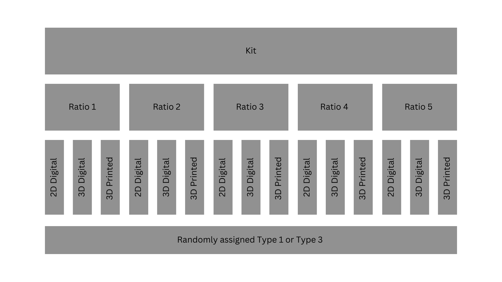
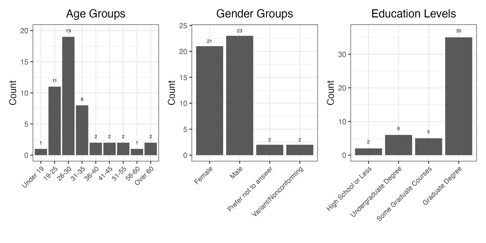
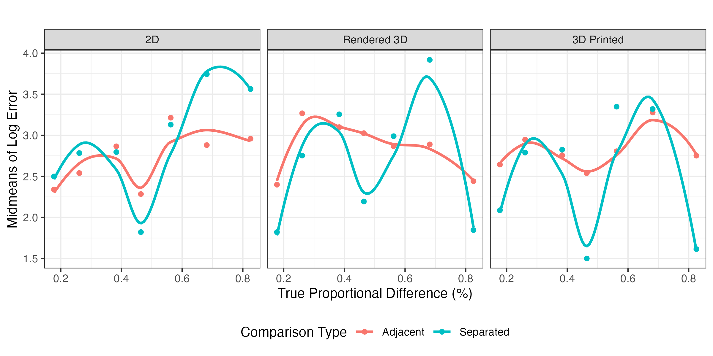

```{r, include = F}
knitr::opts_chunk$set(echo = F, dpi = 300)
```

# Introduction

## Elementary Graphical Tasks
@cleveland_graphical_1984 published a paper that sets up the foundation for how accurately people extract quantitative information using elementary perceptual tasks (EPTs). 
Elementary Perceptual Tasks, according to these experiments, include assessing graphical elements such as position along a common scale, length, angle, and volume, and estimating the corresponding numerical value of these representations.
They found that \svp{estimates of ratios between positions along a common scale had smaller log errors than estimates of ratios between lengths}. The study relied entirely on estimation accuracy, which may not always be relevant when extracting information from graphs. For example, \svp{estimation is less relevant when ordering values by size}
@heerCrowdsourcingGraphicalPerception2010b replicated some parts of @cleveland_graphical_1984 in an online setting using Mechanical Turk, largely replicating the results of the original study while demonstrating the utility of the Mechanical Turk platform.
<!-- While the two experiments in their paper highlighted the accuracy for position, length, and angle EPTs, they theorized that the accuracy of judgements using volume was worse than that for judgments using position along a common scale.  -->

Further studies have shown that 3D graphs are less accurate at portraying numeric information that 2D graphs [@barfield_effects_1989;@fisher_data_1997]. In certain contexts and conditions, there is some research suggesting that 3D graphs may better encode information \citep{brath_3d_2014}.

## 3D Graphical Perception
Chart perception is often affected by the visual system's implicit assumption that visual stimuli are three-dimensional; after all, most of the visual input we process does come from a three-dimensional world, but charts are artificial and largely exist in two dimensions.
This occasionally causes problems: the line-width illusion, for instance, has been attributed to implicit 3D perception of two-dimensional stimuli and can affect perception of error bands, candlestick plots, and Sankey diagrams [@vanderplasSignsSineIllusion2015;@daySineIllusion1991;@hofmannCommonAnglePlots2013].


The use of 3D graphics have been explored in multiple studies. 
@fisher_data_1997 explored the preference of using either 2D or 3D graphs and found that subjects tended to use simpler 2D graphs when tasked with extracting information. @barfield_effects_1989 compared 2D and 3D graphs presented on paper and on computers.
Their results showed that the accuracy of subject answers depended on their skill level. 
Novice subjects were more accurate with 2D paper graphs and experienced managers were more accurate with 3D computer graphs. 
For both experience levels, participants were more confident in their answers using 2D graphs over other presentations of data. 
There are instances where 2D graphs perform better than 3D graphs, but there are times where 3D graphs may better encode information.
@brath_3d_2014 highlights the intrinsic attributes of 3D graphs and its benefits when used appropriately with other 3D elements such as lighting and correct portrayal of data attributes.

There is thus good reason to be wary of the use of three dimensions where only two are necessary to convey data. 
However, the situation is different now than it was in 1984 when Cleveland \& McGill published their seminal work; it has even changed since 2014. 
Digital graphics has developed quickly, along with the hardware necessary to support these software developments. 
As a result, we have much more natural rendering of 3D objects virtually, and we can also print graphics in three dimensions, moving the artificial charts into a more natural setting.
As a result, it is reasonable to reconsider the use of 3D charts, not only because of technological developments, but because these charts provide the opportunity to make visual graphics accessible to those with limited or absent vision.


Here, we provide the process of replication and modernization of testing perceptual judgments to 2D graphs, 3D graphs projected in 2D environments, and 3D printed bar graphs.


## Selected Components from Cleveland and McGill

Cleveland and McGill provided a theory and tested for the ordering of perceptual importance for the elements of length, position, and angle. 
Their first experiment, referenced as the position-length experiment, used five types of bar charts.
Two of these were grouped bar charts and the other three were stacked bar charts.
Each chart had two bars used for comparison and participants were asked to determine which bar was smaller and give their perceived ratio of the smaller bar to the larger bar.
The two grouped bar charts are for the perceptual element of position along a common scale, where one has zero distance between bars and the other has a fixed distance between bars.
These grouped bar charts will be referenced as adjacent and separated graph types in this paper, respectively.

Our study replicates the procedure for the comparisons of the two grouped bar charts, but with an objective of detecting differences in accuracy between 2D graphs, 3D digital graphs, and 3D printed graphs.


# Methods


Our study is designed to replicate and expand upon the position-length experiment from Cleveland and McGill as closely as possible.
In this section, we will discuss the replication process and the design of our modified version of this experiment.

## Replicating Cleveland and McGill

The first step of replicating the position-length experiment was to determine the heights of the bars that  participants use for comparisons.
These values for the bar heights are linear on a log scale and are given by

\[s_i=10\cdot 10^{(i-1)/12}, \qquad i=1,...,10\]


Each graph presents two bars from the values given above where the participants are asked to judge the ratio of the smaller bar to the larger bar. The ratio of bars used by Cleveland and McGill were 17.8, 26.1, 38.3, 46.4 (twice), 56.2, 68.1 (twice), and 82.5 (twice).
The exact numeric comparisons were not disclosed, but the comparison values used in our study were subjected to the constraints of having the same ratio values and that no value was used more than twice.

Each graph is presented so that there are ten bars where only two of the bars are marked for identification.
Cleveland and McGill did not specify the random process for the heights of the eight other bars, so we used a scaled Beta distribution with parameters that limit excessive noise around the bars used for comparisons.
\svp{Code to reproduce the data generation process, data underlying the plots used in this study, the rendered plots and STL files, anonymized user data, and analysis code can found be at} [https://github.com/TWiedRW/2023-JDS-3dcharts](https://github.com/TWiedRW/2023-JDS-3dcharts). 

## Stimuli Construction

The graphs share a common layout across all formats, where two groupings of five bars are identified by "A" and "B", respectively, and circles and triangles are used to identify the bars participants should compare. Example graphs are shown in
Figure \@ref(fig:plotTypes).
There are some graphical elements that cannot be easily portrayed via 3D printing. For this reason, all graph types do not have axes, grid lines, or floating titles.
<!-- The aspect ratio of the plots presented in the original paper is approximately 0.825:1. The aspect ratio of the plots presented in our study is closer to 0.864:1, but -->
<!-- The aspect ratio of the 2d plots (including only the bars is 2:1), while the aspect ratio of the 3d printed charts is 11:9.5. This is something we probably need to fix.... Until then, let's not go there -->

```{r plotTypes, fig.cap = "Two dimensional, two-dimensional digital rendering, and 3D-printed charts used in this study.", out.width = "100%"}
knitr::include_graphics("plot-types.png", dpi = 300)
```

The ggplot2 [@ggplot2] package was utilized to create the 2D bar charts. 
The scale axis was removed, leaving only the bars and a bar grouping identifier.
The bars used for comparisons had the identifying mark at a height of 5 out of 100 for the 2D plots, and the 3D plots had the identifying marks on top of the bars.

The 3D renderings and 3D printed charts were both created using OpenSCAD [@kintelOpenSCADDocumentation2023], which creates STL files from markup describing the object's geometric composition. 
Charts were composed of a platform, raised labels for the A and B groups of bars, circle and triangle markers indicating the bars of interest, and the bars themselves; values for the bar heights were inserted into the markup using R [@R].
In addition, an ID code was engraved into the bottom of the platform to uniquely identify each object; this allows the researchers to ensure that the 3D printed charts are correctly allocated to stimulus sets.

Digital renderings of the generated STL files were created using @rgl , which integrates into @shiny using the @mozillafoundationWebGL2D3D2023 extension.
Rendered 3D charts were initially angled corresponding to the default 3D bar charts present in Microsoft Excel, but WebGL's interactivity allows the user to rotate, scale, and otherwise interact with the chart to change the angle. 3D renderings were colored to correspond to the 3D printed chart filament color.
The default `rgl` lighting was replaced with three lights located in fixed positions around the rendered figure. 
The lights were positioned so that one was behind the rendered figure <!--(x: 910, y: -1000, z:1000)-->, another in front of the figure <!--(x: 780, y: 1030, z: 1000)-->, and one light below the figure <!--(x: 65, y: 15, z: -100)-->.}
3D charts were printed with colored filament corresponding to a specific ratio comparison; this allowed researchers to visually assess kits to ensure that they contained five unique ratios.
Colors corresponding to each ratio were assigned randomly to ensure that chart color provided no useful information about the ratio value.
As printed, the base of the chart was 13cm x 3cm x 1cm, with the highest bar rising 9.5cm above the chart base.
Raised letters and shapes were 2mm above the base or bar, respectively.

## Experiment Design

Participants were provided a kit with five 3D-printed charts, comprising five of the seven unique ratio comparisons; we then used the kit ID to ensure that participants saw computer-rendered charts with ratios corresponding to those in the kit of physical charts.
This ensured that the experimental design was balanced across chart type and randomized with respect to the type of comparison (adjacent or separated).
We printed 21 kits containing five 3d-printed charts each.
<!-- There are 21 kits in total so that each combination of ratios is accounted for. -->
<!-- Each graph is randomly assigned either an adjacent or separated comparison. -->

```{r studyDesign, fig.cap = "A graphical representation of the study design. Only five of the seven ratios were used in each kit where the ratios are randomly selected. A total of 21 kits were created to include all combinations of the five ratios."}

```


## Participant Recruitment

One interesting facet of @cleveland_graphical_1984 is the participant recruitment methodology: "For each experiment the subjects fell into two categories: (1) a group of females, mostly housewives, without substantial technical experience; (2) a mixture of males and females with substantial technical training and working in technical jobs. 
Most of the subjects in the position-length experiment participated in the position-angle experiment; in all cases repeat subjects judged the position-angle graphs first." 
It would seem likely that the authors recruited individuals within their respective departments as well as their wives.
In the spirit of replicating the study, members of the UNL Statistics department and their spouses, partners, and roommates were asked to participate in our study; this replicates the spirit of the original study without the implicit assumptions that graduate students and professors are (1) largely male, (2) heterosexual, and (3) have unemployed partners.


A total of 49 participants completed the study; demographics are shown in \@ref(fig:demographics).

```{r demographics, fig.cap = "Demographic breakdown of participants in the study. All subjects were recruited from faculty and students in the statistics department at University of Nebraska-Lincoln.", out.width='85%'}

```


## Data Collection

A Shiny applet was used for data collection, along with the provided kit of 3D printed charts.
Participants provided informed consent through the applet, and then were asked for demographic information (age, gender, education level). 
Then, participants were shown a "practice" page which allowed them to experiment with the data collection interface and practice estimating the ratio between the bars, as shown in Figure \@ref(fig:practice)

```{r practice, fig.cap = "Screenshot of Shiny application practice screen. Three 2D bar charts with different ratios were provided, along with sliders indicating the correct proportion. Participants could practice with the sliders and preview the questions that would be asked as part of the task.", out.width = "80%"}

```

Directly before the experiment started, participants were asked to provide the kit ID, along with directions indicating that if the instructions indicated that participants should use a 3D chart for a task, the participant should select a chart from the kit, enter the ID code of that chart from the bottom of the object, and complete the requested task.
Participants were also instructed to make quick judgments for each graph and not to measure or estimate ratios using physical objects.

```{r experiment3dRender, fig.cap = "Screenshot of the applet collecting data for a 3D rendered chart task. Participants were asked to select which bar (circle or triangle) was smaller, and then to estimate the ratio of the smaller bar to the larger bar.", out.width = "80%"}

```

Each graph (or prompt, in the case of 3D printed charts) in the applet had two corresponding questions for participants to answer: first, participants were to identify the smaller bar by shape, and then, participants were to estimate the ratio of the size of the smaller bar to the size of the larger bar, as shown in Figure \@ref(fig:experiment3dRender). 


# Results

All responses that incorrectly identified the smaller bar were removed from the study before analysis.

## Midmeans of Log Absolute Errors
Cleveland and McGill used 
$$\log_2(|\text{Judged Percent} - \text{True Percent}|+1/8)$$
to measure accuracy of their participant's responses. 
In their study, log base 2 seemed appropriate due to "average relative errors changing by factors less than 10."
They also added 1/8 to prevent distortions when the errors were close to zero. 
@heerCrowdsourcingGraphicalPerception2010b followed the same analysis method, replicating many (but not all) of the results presented in the original paper.

Figure \@ref(fig:midmeans-log-errors) shows the midmeans of the log absolute errors compared to the true ratio of the bars for each graph type and comparison type. 
The results tend to indicate that the log absolute errors increase for greater differences between the smaller and larger bars, but are consistent across the graph types.

```{r midmeans-log-errors, fig.cap = 'Midmeans of log absolute errors for the true ratio of bars. Each overlaying line are computed with loess.', out.width='80%'}

```
\svp{This is somewhat different than the results in} @cleveland_graphical_1984 and @heerCrowdsourcingGraphicalPerception2010b\svp{; in both cases the midmean log absolute errors increased until about 55% of the true proportional difference and then decreased.
It is possible that this difference is due to the fact that we did not require an explicit numerical estimate of the ratio but instead asked participants to indicate the ratio on a slider (which is essentially a number line). 
This should reduce the cognitive load required to transition from spatial comparison to numerical comparison and then to compute the proportion, but may also have impacted the results.}

## Linear Mixed Effects Model

\svp{In addition to replicating the (primarily graphical) analysis of participant errors, we also took a more statistical approach and fitted a linear mixed effects model that accounts for participant variation as well as the effect of comparison type, graph type, and ratio. This allows us to test for significant differences (though given the midmean log absolute error plots, we do not expect to find any) as well as to quantify effect sizes for future studies. The formal statistical model is as follows:}

$$y_{ijklm}=\mu+S_i+R_j+G(R)_{(k)j}+T_l+\epsilon_{ijklm}$$

\noindent where

- $y_{ijklm}=\log_2(|\text{Judged Percent} - \text{True Percent}|+1/8)$

- $S_i\sim N(0,\sigma^2_S)$ is the effect of the $i^{th}$ subject

- $R_j$ is the effect of the $j^{th}$ ratio

- $G(R)_{(k)j}$ is the effect of the $k^{th}$ graph type nested in the $j^{th}$ ratio

- $T_l$ is the effect of the $l^{th}$ comparison type

- $\epsilon_{ijklm}\sim N(0,\sigma^2_\epsilon)$ is the random error

No differences were detected for the true ratio of bars (p-value = .689), whether the bars were adjacent or separated (p-value = .220), or for the plot nested within the true ratio (p-value = .837). 
\svp{While Heer \& Bostock provided a zip file contianing data and code for their paper, the link is no longer active, so it is not possible to fit a similar model to their data at this time.}

# Discussion and Future Work

Previous work in 3D graphics would suggest that the errors for the 3D graphs would be larger than the errors for the 2D graphs. 
While we did not find any significant results indicating that 3D graphs are read less accurately, there are two possibilities that might account for this discrepancy. 

The first \svp{potential explanation} is that this study is underpowered - the effect size is small, and our 49 participants were insufficient; the original study included 51 participants, which is slightly larger. \svp{However, we should note that the analysis methods used in} @heerCrowdsourcingGraphicalPerception2010b and @cleveland_graphical_1984 \svp{do not include significance testing beyond the graphical display of confidence intervals.} 

The second possibility is more interesting: we examined 3D charts using rendered 3D graphs and 3D printed charts; both of these options allow for participants to interact with the chart, rotating it, and generally perceiving it as one might perceive any other 3D, real, object.
This is a far cry from the 3D perspective charts in the original study, which have a fixed angle and perspective and are thus not equivalent to our 3D charts. 
Future studies should include an additional fixed 3D perspective bar chart, which will at least enable us to examine whether modern 3D rendering environments allow for more accurate conclusions than fixed 3D perspectives. Future iterations of this study will include "traditional" 3D graphs created by Microsoft Excel (that is, graphs with a fixed 3D perspective rendered in 2D). This option will allow us to examine fixed perspective 3D plots compared to 3D renderings and 2D plots; it will also enable online data collection in addition to the in-person data collection used in this experiment. 

\svp{Another interesting aspect of our study is that the method used to record participant estimates is different from the method used in the original study as well as Heer \& Bostock's replication study. 
A method similar to our slider input, marking position on a line, was used in} @spenceVisualPsychophysicsSimple1990, \svp{but Spence asked participants to estimate} $A/(A+B)$, where we asked participants to estimate $A/B$; \svp{thus, our results are still not directly comparable to previous studies.
We expect that the specific ratio estimated would also have an effect on observed participant errors.}

\svp{The slider method for input of ratio estimates should be easier for participants, as it does not require explicit transformation to the numerical domain. 
What is clear is that it would be beneficial to assess the impact of measurement method on participant errors directly, so that the results of these different studies might be explained and interpreted with regard both to the stimuli used and the measurement method employed in the experiment.
Future iterations of this experiment will likely address this estimation difference; such modifications in experimental design are relatively straightforward in Shiny and will provide useful insight into the design of future experiments evaluating the perception of statistical graphics.}

<!-- The goal of this study was to verify that previous research into graphics is upheld under a new set of circumstances. It started with a question, followed by research into prior work, and then by designing and conducting a study. This general framework of research is useful to all fields of study and is taught in most introductory statistics courses. The next step of this study is to collect more data while simultaneously providing students the opportunity to learn about the research process from both the perspectives of an experiment participant and the views of the researchers. At University of Nebraska-Lincoln, students taking introductory statistics will have the opportunity to participate in the experiment while also completing pre/post experiment surveys and reflections on a two-page abstract and a presentation of results. -->

## Supplemental Material
Stimuli, code, and data for this experiment are provided at [https://github.com/TWiedRW/2023-JDS-3dcharts](https://github.com/TWiedRW/2023-JDS-3dcharts).


